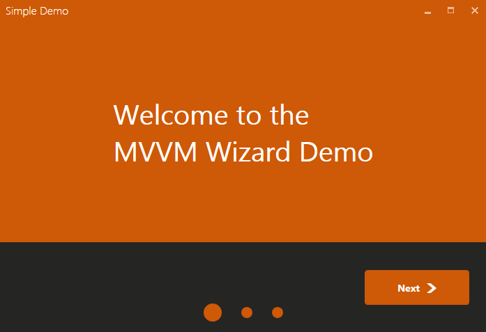

# MVVM Wizard
 [](https://www.nuget.org/packages/MvvmWizard)
 [](https://github.com/lezhkin11/mvvm-wizard/blob/master/LICENSE)
 
MvvmWizard gives possibility to create wizard with steps in simply manner.
It's highly configurable with set of built-in options and styles.
<br />
Supports [MahApps.Metro](https://mahapps.com/) themes

## Demo
* [bin](https://github.com/lezhkin11/mvvm-wizard/releases/download/1.1.1/mvvm-wizrard-demo-bin.zip)
* [code](https://github.com/lezhkin11/mvvm-wizard/tree/master/src/WizardDemo)

<div>

</div>

## Usage
[Documentation](https://github.com/lezhkin11/mvvm-wizard/wiki)

### 1 Set ViewResolver
```csharp
using MvvmWizard.Classes;

WizardSettings.Instance.ViewResolver = viewType => unityContainer.Resolve(viewType);
```

### 2 Create Wizard Control
`xmlns:controls="clr-namespace:MvvmWizard.Controls;assembly=MvvmWizard"`

```xml
<controls:Wizard FinishCommand="{Binding CloseCommand}">
    <controls:WizardStep ViewType="{x:Type simple:WelcomeView}" BackButtonVisibility="Collapsed" />
    <controls:WizardStep ViewType="{x:Type simple:RegistrationView}" />
    <controls:WizardStep ViewType="{x:Type simple:RegistrationSummaryView}" ForwardButtonTitle="Finish" />
</controls:Wizard>
```
### Licence
[MIT License (MIT)](./LICENSE)
